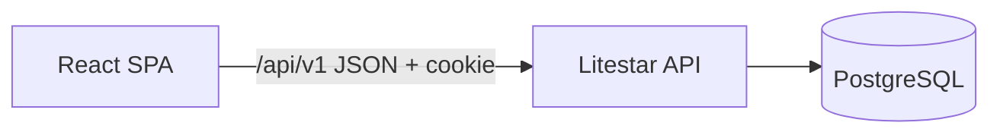
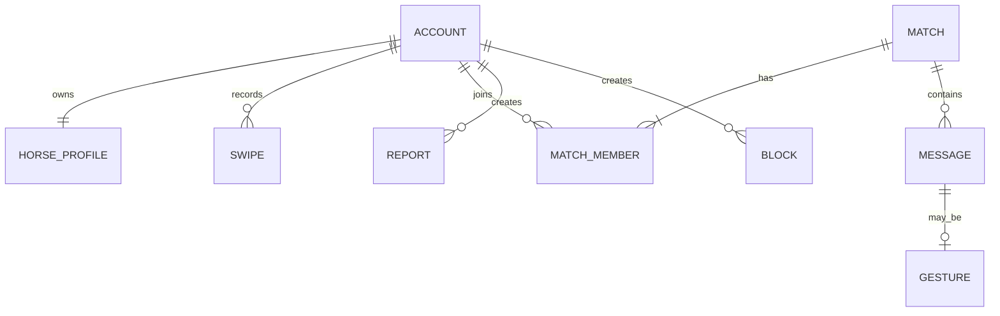

# Architecture Spine — Horse Tinder

## Design Paradigm

Modular monolith: a React SPA and a Litestar JSON API own separate runtime boundaries; each backend feature module owns its routes, services, and persistence access.



## Invariants & Rules

### AD-1 — Runtime boundary [ADOPTED]

- **Binds:** all features
- **Prevents:** frontend imports of server logic and server-rendered UI coupling
- **Rule:** `apps/web` communicates only through `/api/v1`; `apps/api` exposes JSON contracts and never serves feature UI.

### AD-2 — Feature ownership

- **Binds:** accounts, profiles, discovery, matches, chat, safety, stable-plus
- **Prevents:** cross-feature direct database writes
- **Rule:** Each API feature module owns its command/service layer; routes call services, and services are the only mutation path.

### AD-3 — Authoritative social state

- **Binds:** Swipes, Matches, Chat, Strikes, blocks, reports
- **Prevents:** client-created Matches, unauthorized Chat reads, and duplicate ownership
- **Rule:** PostgreSQL is authoritative; every mutation derives actor identity from the authenticated session and verifies resource ownership/membership server-side.

### AD-4 — API and failure contract

- **Binds:** all client/server calls
- **Prevents:** one-off endpoint shapes and ambiguous UI failure states
- **Rule:** Version every route under `/api/v1`; use JSON request/response DTOs and one documented JSON error shape `{code,message,details?}`. The client maps errors to UX states; it does not invent domain outcomes.

### AD-5 — Chat delivery boundary

- **Binds:** Chat and Match screens
- **Prevents:** premature websocket infrastructure and transport-dependent UI
- **Rule:** v1 fetches Chat messages with REST and short-interval polling while active. Read receipts, typing, and push are deferred.

### AD-6 — Authentication and sensitive data

- **Binds:** Account, Profile, Match, Chat, safety
- **Prevents:** browser-token leakage and public contact data
- **Rule:** Use cookie-backed sessions; auth cookies are `HttpOnly`, `Secure` in production, and `SameSite=Lax`. Account-only fields never appear in public Horse Profile DTOs.

### AD-7 — Social mutation integrity

- **Binds:** Swipes, Matches, messages, Strikes, blocks, fixtures
- **Prevents:** duplicate Matches, blocked Chat access, reordered messages, and nondeterministic demos
- **Rule:** Swipe-to-Match runs in one transaction with unique relational constraints; blocks are checked before every discovery, Match, and Chat read/write; Chat messages use server timestamps and idempotency keys; Strike lifecycle is server-owned; fixtures include deterministic mutual-match and Gesture paths.

### AD-8 — Same-origin session deployment

- **Binds:** web deployment and authenticated API calls
- **Prevents:** cross-origin cookie failures and CSRF gaps
- **Rule:** Production serves the SPA and `/api/v1` from one origin. Every unsafe request carries a server-validated CSRF token; cross-origin credentialed CORS is not a v1 path.

## Consistency Conventions

| Concern | Convention |
| --- | --- |
| Names | API resources plural kebab-case; Python modules snake_case; React components PascalCase |
| IDs and time | UUID identifiers; ISO-8601 UTC timestamps in API payloads |
| Mutation | POST/PATCH/DELETE only through feature services; optimistic UI may reconcile only from server response |
| Seed data | Seeded Horse Profiles and Gestures live in versioned backend fixtures, never frontend-only constants |
| Config | Environment variables are validated at API startup; secrets never enter the SPA build |

## Stack

| Name | Version |
| --- | --- |
| React | 19.2 |
| Vite | 8.2 |
| Litestar | 2.24 |
| PostgreSQL | 18 |

## Structural Seed

```text
HorseTinder/
  apps/web/                 # React SPA
    src/features/           # discovery, matches, chat, profile, safety
    src/api/                # typed API client and DTO mapping
  apps/api/
    app/features/           # routes, services, repositories by feature
    app/db/                 # connection, migrations, fixtures
  docs/                     # API and deployment notes
```



## Capability → Architecture Map

| Capability / Area | Lives in | Governed by |
| --- | --- | --- |
| Account and Horse Profile | `features/accounts`, `features/profiles` | AD-2, AD-6 |
| Swipe and Match | `features/discovery`, `features/matches` | AD-2, AD-3, AD-4 |
| Chat and Gesture | `features/chat` | AD-3, AD-4, AD-5 |
| Strike / Red Flag / genie | `features/discovery`, `features/stable_plus` | AD-2, AD-3 |
| Block and report | `features/safety` | AD-3, AD-6 |

## Deferred

- Auth provider and deployment platform — choose when hosting constraints are known.
- ORM/migration tooling — choose with the API scaffold; must preserve AD-2/AD-3.
- WebSockets, notifications, read receipts, typing — revisit only when polling no longer meets the UX.
- Image storage and moderation workflow — revisit before public access or user uploads.
